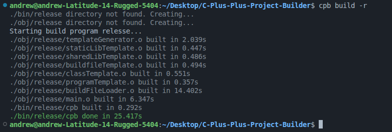
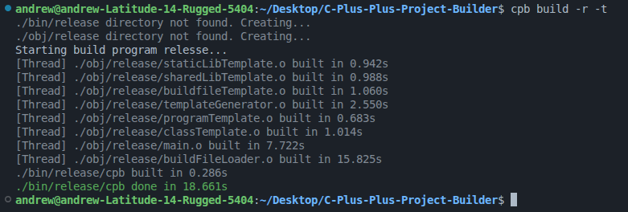

# CPB - C++ Project Builder

A powerful, user-friendly command-line tool for building C++ projects with multi-threaded compilation, cross-platform support, and built-in project scaffolding. Define your build configuration once in `build.toml` and compile efficiently across different architectures and build types.

## Quick Start

### Installation & Compilation

```bash
# Clone the repository
git clone https://github.com/Fish-Soup-Dev/C-Plus-Plus-Project-Builder.git
cd C-Plus-Plus-Project-Builder

# Build in Release mode (optimized)
make release

# Or build in Debug mode (with debugging symbols)
make debug

# Binary will be available at: ./bin/cpb (Linux) or ./bin/cpb.exe (Windows)
```

### First Use: Create a New Project

```bash
# Generate a new project template
cpb new

# This creates a project structure with a build.toml configuration file
```

## Features

✨ **Multi-Threaded Compilation** - Significantly faster builds by compiling multiple source files in parallel
- Use the `-t` or `-threads` flag for parallel compilation (30% - 50% speedup on multi-core systems)

🏗️ **Multiple Build Types**
- Debug builds with full debugging symbols and warnings
- Release builds with optimization flags (-O2)

🎯 **Cross-Architecture Support**
- x64 (default)
- x32
- ARM64

📦 **Project Templates** - Quickly scaffold new projects with built-in templates for:
- Programs/Executables
- Static Libraries (.a / .lib)
- Shared Libraries (.so / .dll)
- Class templates
- Build file templates

🖥️ **Cross-Platform** - Works seamlessly on:
- Linux
- Windows

⚙️ **Flexible Configuration** - Centralized `build.toml` file for all compiler settings, flags, and dependencies

🔢 **Automatic Version Management** - Semantic versioning with automatic patch incrementing on debug builds
- Manages major.minor.patch versions directly in build.toml
- Auto-increment patch version with each debug build
- Manual commands to bump minor or major versions
- Automatic version embedding in compiled binaries

## Usage

### Basic Commands

```bash
cpb help              # Display help menu
cpb version           # Show application version
cpb new               # Create a new project with templates
cpb class             # Create a new class template
cpb build             # Build the project (debug by default, auto-bumps patch version)
cpb run               # Run the built executable
cpb clean             # Remove all temporary build files and directories
cpb minor             # Increment minor version (resets patch to 0)
cpb major             # Increment major version (resets minor and patch to 0)
```

### Build Flags

```bash
# Release vs Debug
cpb build -r          # Build in Release mode (optimized, no debug symbols)
cpb build -d          # Build in Debug mode (default, with debug symbols)
cpb build -release    # Long form for Release
cpb build -debug      # Long form for Debug

# Multi-Threaded Compilation
cpb build -t          # Build using multi-threaded compilation
cpb build -t -r       # Multi-threaded Release build
cpb build -threads    # Long form

# Architecture Targeting
cpb build -x64        # Build for 64-bit (default)
cpb build -x32        # Build for 32-bit
cpb build -arm64      # Build for ARM64

# Combining Flags
cpb build -r -t -x64  # Release, multi-threaded, 64-bit
cpb run -d            # Run debug build
```

### Project Configuration

Edit `build.toml` in your project root to configure:

```toml
[project]
name = "my_project"
type = "program"          # Options: program, static, shared
version = "1.0.0"         # Semantic versioning (major.minor.patch)

[compiler]
cc = "g++"
ldflags = []

[compiler.windows]
libs = []

[compiler.linux]
libs = []

[compiler.release]
cflags = ["-O2", "-std=c++20", "-pthread", "-static"]
cdefs = ["-DNDEBUG"]

[compiler.debug]
cflags = ["-g", "-Wall", "-std=c++20", "-pthread", "-static"]
cdefs = ["-DDEBUG"]

[paths]
src = "./src"
include = "./include"
lib = "./lib"
bin = "./bin"
obj = "./obj"
```

## Version Management

CPB includes automatic semantic versioning support. Version numbers are stored in `build.toml` and embedded in your compiled binaries via a `-DVERSION` compiler define.

### How Versioning Works

**Version Format:** `major.minor.patch` (e.g., `1.2.3`)

**Debug Builds:** Automatically increment the patch version each time you run `cpb build` in debug mode (default). This ensures you can track development builds.

**Release Builds:** Do not auto-increment. Use explicit version bump commands before releases.

### Version Commands

```bash
# View current version
cpb version

# Increment patch version (e.g., 1.2.3 → 1.2.4)
cpb build              # Auto-bumps patch in debug mode
cpb build -r           # Release build (no auto-bump)

# Increment minor version and reset patch (e.g., 1.2.3 → 1.3.0)
cpb minor

# Increment major version and reset minor/patch (e.g., 1.2.3 → 2.0.0)
cpb major
```

### Using Version in Code

The version is automatically compiled into your binary as a `VERSION` define. Access it in your C++ code:

```cpp
#include <iostream>

int main()
{
    #ifdef VERSION
        std::cout << "Application version: " << VERSION << std::endl;
    #endif
    return 0;
}
```

## Performance Comparison

### Standard Build vs Multi-Threaded Build

**Standard Compilation:**


**Multi-Threaded Compilation (30% - 50% faster):**


## Requirements

- GCC/G++ (or compatible C++ compiler)
- GNU Make
- C++20 or later support

## License

See [LICENSE](LICENSE) file for details.