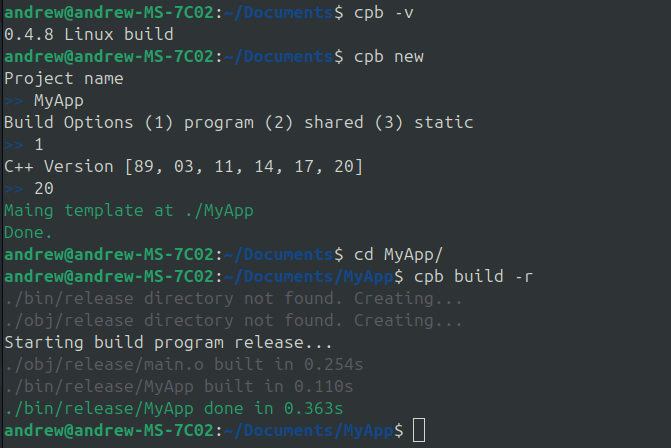

# cpb (c++ project builder)
Simple command-line tool for building c++ projects using a build.toml file. Currently it can build a debug build and a release build with differing flags and defines. This is a work in progress.

## Uesage
Download the repo and then open the folder and run "make release" to build

Example Screenshot

